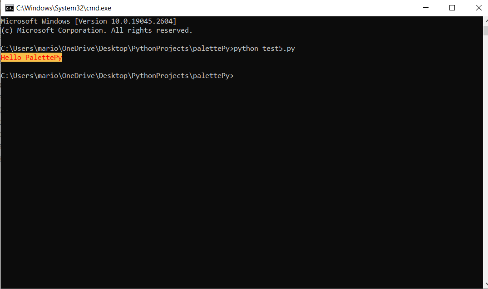
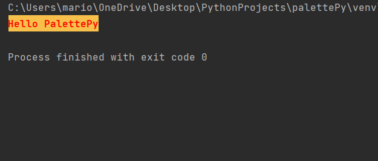
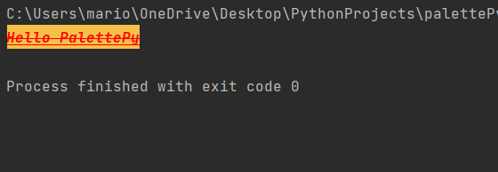
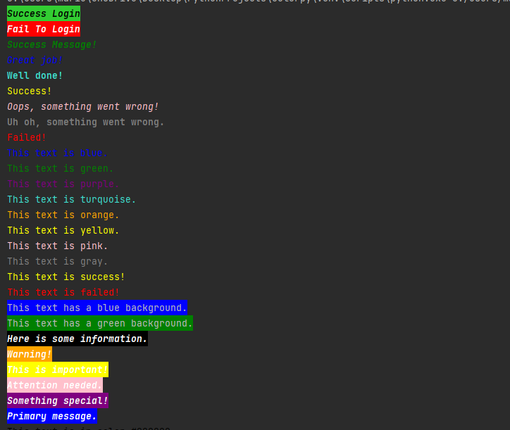
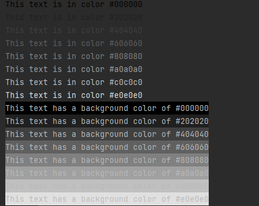
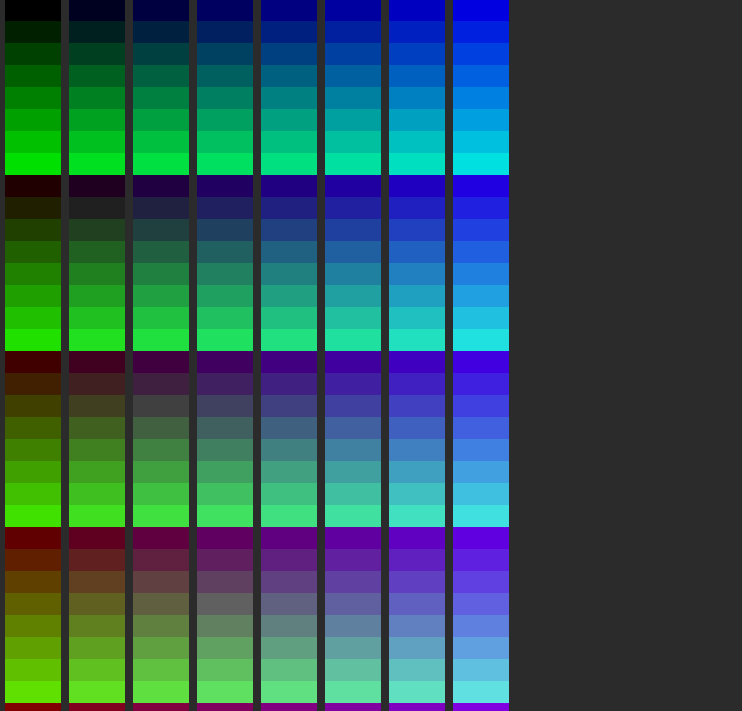
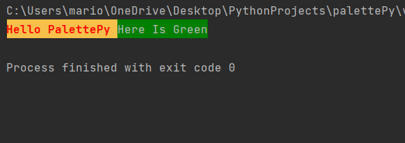

## PalettePy

PalettePy: A Python library for powerful and easy console text styling with RGB 24-bit colors and default printing styles.

Description
-----------

PalettePy is an incredible Python library that can make your console outputs much more visually appealing and powerful. With PalettePy, you can style your text with a variety of colors and styles using RGB 24-bit colors, set different foreground and background colors, and create stylish print outputs without worrying about string concatenation.

Not only does PalettePy make styling your text easy and effortless, it also supports default printing styles, which means that you don't need to edit your print function to enjoy the benefits of this library. This makes it easy to create eye-catching and attractive console outputs that will grab people's attention and make your code stand out. Overall, if you want to take your console outputs to the next level, PalettePy is definitely worth checking out!

Installation
------------
    pip install palettepy

Usage
-----
PalettePy is an amazing Python library that is supported on Linux and Mac, and partially on Windows (with support for colors but not text styling) [Windwos 10 version number 1607 or an earlier version]


 

    from palettepy import init,print,Printer


    # RGB RED foreground Color , and Yellow background
    init(Printer(foreground_color="#ff0000",background_color="#F7C04A",bold=True))


    # Any Print Will Have The Defualt Configration
    print("Hello PalettePy")




```python
    # Import the necessary functions from the palettepy module
from palettepy import Printer, init, print

# Create a Printer object with a custom style
my_printer = Printer(foreground_color="#ff0000", background_color="#F7C04A", bold=True, italic=True, underline=True,
                     strikethrough=True)

# Initialize the printing environment with our custom Printer object
init(my_printer)

# Print some text using our custom style
print("Hello PalettePy")
```

**Printer class attributes:**

- `foreground_color`: A string representing the desired foreground color of the text. This can be specified as a 24-bit RGB value (e.g. "#FF0000" for red) or a named color (e.g. "red").

- `background_color`: A string representing the desired background color of the text. This can be specified in the same way as `foreground_color`.

- `bold`: A boolean value indicating whether the text should be displayed in bold font.

- `italic`: A boolean value indicating whether the text should be displayed in italic font.

- `underline`: A boolean value indicating whether the text should be underlined.

- `strikethrough`: A boolean value indicating whether the text should be displayed with a strikethrough line.





**Awesome Feature: Easy Text Styling with PalettePy**

One of the most powerful features of PalettePy is its ability to make printing text in different colors and styles incredibly easy. With just a few lines of code, you can create custom styles for your text and use them to print messages without any string concatenation or formatting errors.

The example code below demonstrates how to use PalettePy to create custom text styles and print messages in different colors:


**Creating color styles**

To create a color style for your text, you need to use the color_style_foreground or color_style_background function. These functions take a hex color code as an argument and return a function that can be used to apply the color style to your text.
Here's an example of how you can create a green foreground color style:

```python
    green_fg = color_style_foreground("#008000")
```

Similarly, you can create a blue background color style like this:

```python
    blue_bg = color_style_background("#0000FF")
```


**Applying styles to text**

Once you have created a color style, you can use it to apply the color and style to your text. Here's an example of how you can apply a green foreground color style to your text:


```python
    success = bold(italic(green_fg("Success!")))
```

This creates a style that applies bold and italic styles to your text, and then applies the green foreground color style to it. You can then print the styled text using the print function:


```python
    print(success)
```

**Resetting the style**

```python
    print(f"Here is Default Configuration {reset(success('Success Message'))}")
```


Examples
------------

```python
    # Import the necessary functions from the palettepy module
from palettepy import init, color_style_foreground

# Initialize PalettePy
init()

# Define some custom styles for different colors
green = color_style_foreground("#00ff00")
red = color_style_foreground("#ff0000")
blue = color_style_foreground("#0000ff")

# Print some text using our custom styles
print(green("Hello PalettePy In Green"))
print(red("Hello PalettePy In Red"))
print(blue("Hello PalettePy In Blue"))

```

**Other Big Example With More Styles**

```python

from palettepy import color_style_foreground, color_style_background, bold, italic, init

init()

# Success message styles
black = color_style_foreground("#000000")
lime_green = color_style_background("#32CD32")
success = black(lime_green(bold(italic)))
blue_bg = color_style_background("#0000FF")
green_bg = color_style_background("#008000")

red = color_style_foreground("#FF0000")
yellow = color_style_foreground("#FFFF00")
blue = color_style_foreground("#0000FF")
green = color_style_foreground("#008000")
purple = color_style_foreground("#800080")
turquoise = color_style_foreground("#40E0D0")
orange = color_style_foreground("#FFA500")
pink = color_style_foreground("#FFC0CB")
gray = color_style_foreground("#808080")
success2 = bold(italic(green))
success3 = blue(italic)
success4 = turquoise(bold)
success5 = yellow

# Failure message styles
red_bg = color_style_background("#FF0000")
red_fg = color_style_foreground("#FFFFFF")
fail = red_bg(red_fg(bold(italic)))

fail2 = pink(italic)
fail4 = gray(bold)
fail5 = red

# General message styles
white = color_style_foreground("#FFFFFF")
black_bg = color_style_background("#000000")
black_fg = color_style_foreground("#FFFFFF")
info = black_fg(black_bg(bold(italic)))
warning = black_fg(color_style_background("#FFA500")(bold(italic)))
highlight = black_fg(color_style_background("#FFFF00")(bold(italic)))
attention = black_fg(color_style_background("#FFC0CB")(bold(italic)))
special = black_fg(color_style_background("#800080")(bold(italic)))
primary = black_fg(color_style_background("#0000FF")(bold(italic)))

# Print the messages
print(success("Success Login"))
print(fail("Fail To Login"))
print(success2("Success Message!"))
print(success3("Great job!"))
print(success4("Well done!"))
print(success5("Success!"))
print(fail2("Oops, something went wrong!"))
print(fail4("Uh oh, something went wrong."))
print(fail5("Failed!"))

# Additional examples
print(blue("This text is blue."))
print(green("This text is green."))
print(purple("This text is purple."))
print(turquoise("This text is turquoise."))
print(orange("This text is orange."))
print(yellow("This text is yellow."))
print(pink("This text is pink."))
print(gray("This text is gray."))
print(success5("This text is success!"))
print(fail5("This text is failed!"))

print(blue_bg("This text has a blue background."))
print(green_bg("This text has a green background."))

print(info("Here is some information."))
print(warning("Warning!"))
print(highlight("This is important!"))
print(attention("Attention needed."))
print(special("Something special!"))
print(primary("Primary message."))


```




**Example**

```python

from palettepy import color_style_foreground, color_style_background, bold, italic, init

init()

start = 0
end = 256
step = 32

# Loop over the range of integers and generate hex color codes
for i in range(start, end, step):
    color_code = hex(i)[2:].zfill(2) * 3
    color_style = color_style_foreground(f"#{color_code}")
    print(color_style(f"This text is in color #{color_code}"))

# Loop over the range of integers and generate background colors
for i in range(start, end, step):
    color_code = hex(i)[2:].zfill(2) * 3
    color_style = color_style_background(f"#{color_code}")
    print(color_style(f"This text has a background color of #{color_code}"))


```




**Example Of Some Colors**

```python

from palettepy import color_style_foreground, color_style_background, bold, italic, init

init()

r_values = range(0, 256, 32)
g_values = range(0, 256, 32)
b_values = range(0, 256, 32)
count = 0
for r in r_values:
    for g in g_values:
        for b in b_values:
            # Convert the RGB values to a hex string
            hex_code = f"#{r:02X}{g:02X}{b:02X}"

            # Create a color style using the hex code
            bg_style = color_style_background(hex_code)

            # Create a success message using the color style
            success = bold(italic(bg_style("       ")))

            # Print the success message
            print(success, end=' ')

            # Increment the color count
            count += 1

            # Print a newline after printing 8 colors in a line
            if count % 8 == 0:
                print()


```




**Reset**

If you want to use the default print() function but still apply color and style configurations, you can do so by wrapping the styled text with the reset() function. This function will reset the color and style to the default values after the styled text has been printed.

Here's an example of how you can use the reset() function with the print() function:

```python

from palettepy import init, print, Printer, reset, color_style_background

# RGB RED foreground Color , and Yellow background
init(Printer(foreground_color="#ff0000", background_color="#F7C04A", bold=True))

green_bg = reset(color_style_background("#008000"))

# Any Print Will Have The Defualt Configration
print(f"Hello PalettePy {green_bg('Here Is Green')}")

```

In this example, we initialize PalettePy with a red foreground color and a yellow background color. We then create a green background color style and use it to style the text "Here Is Green". We wrap the styled text with the reset() function to reset the color and style to the default values after the text has been printed.

The output of this code will be "Hello PalettePy Here Is Green", where "Here Is Green" is printed with a green background color and the rest of the text is printed with the default color and style.


